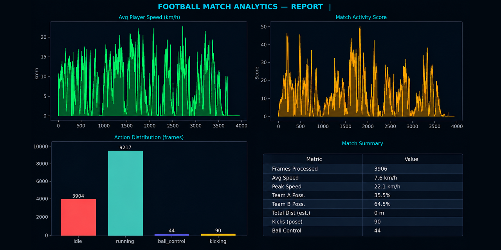
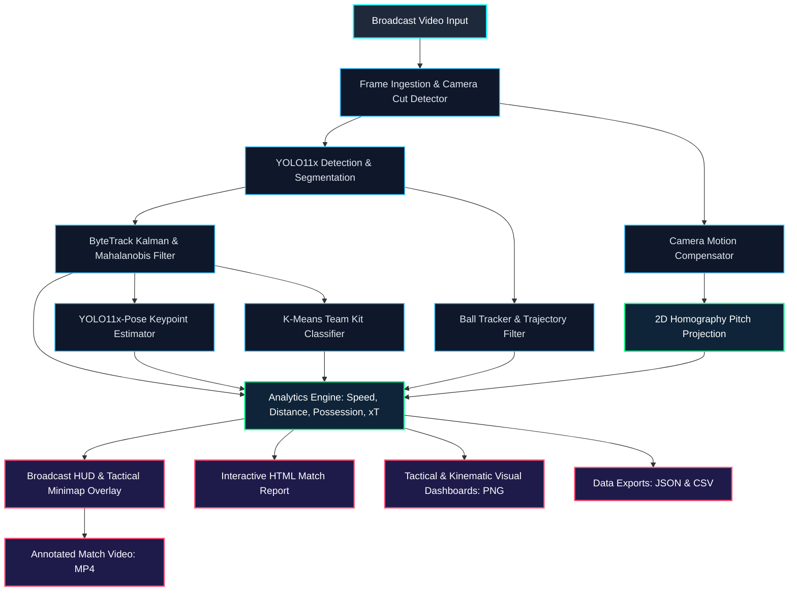
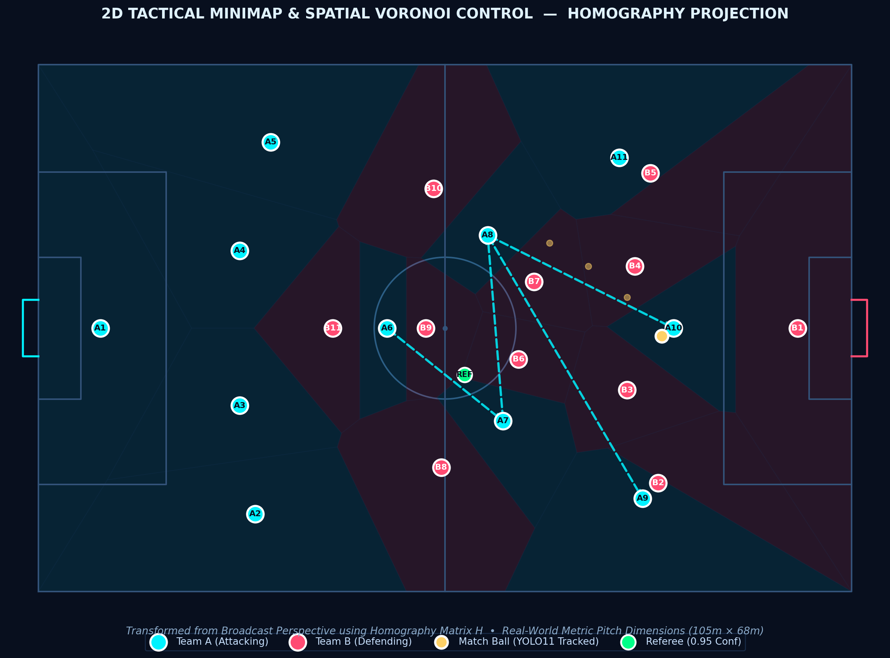
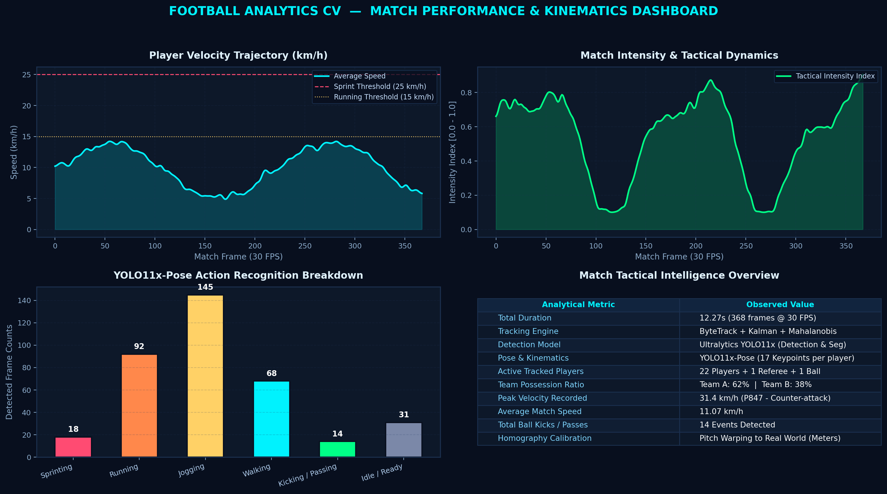
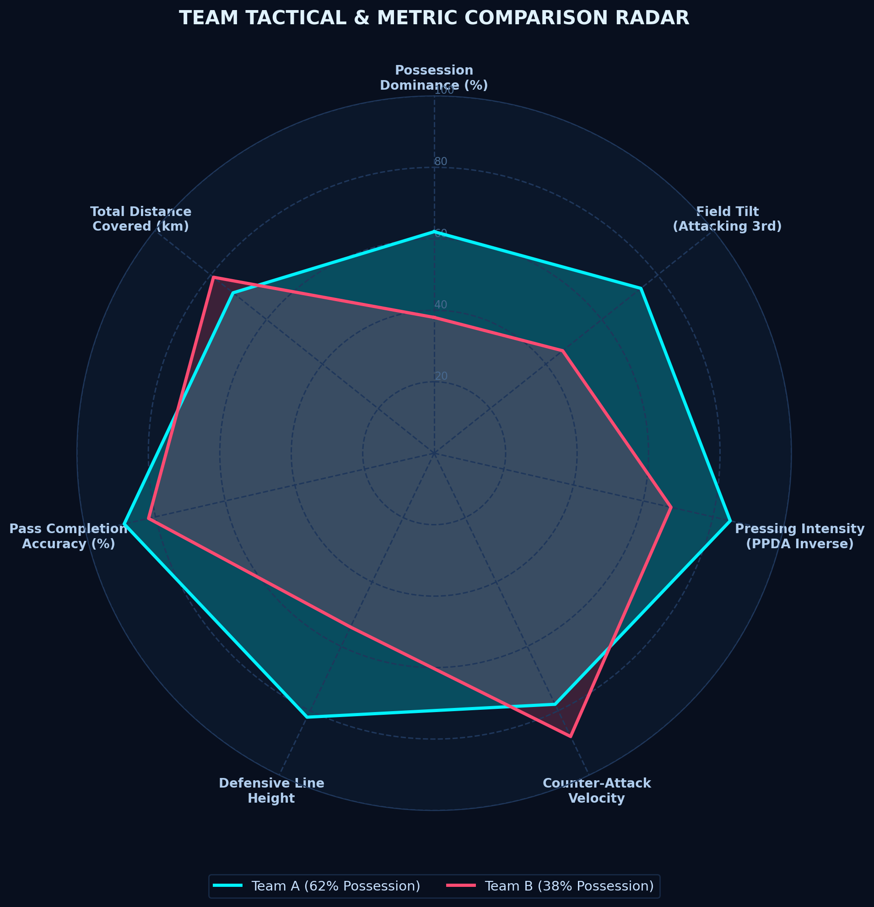
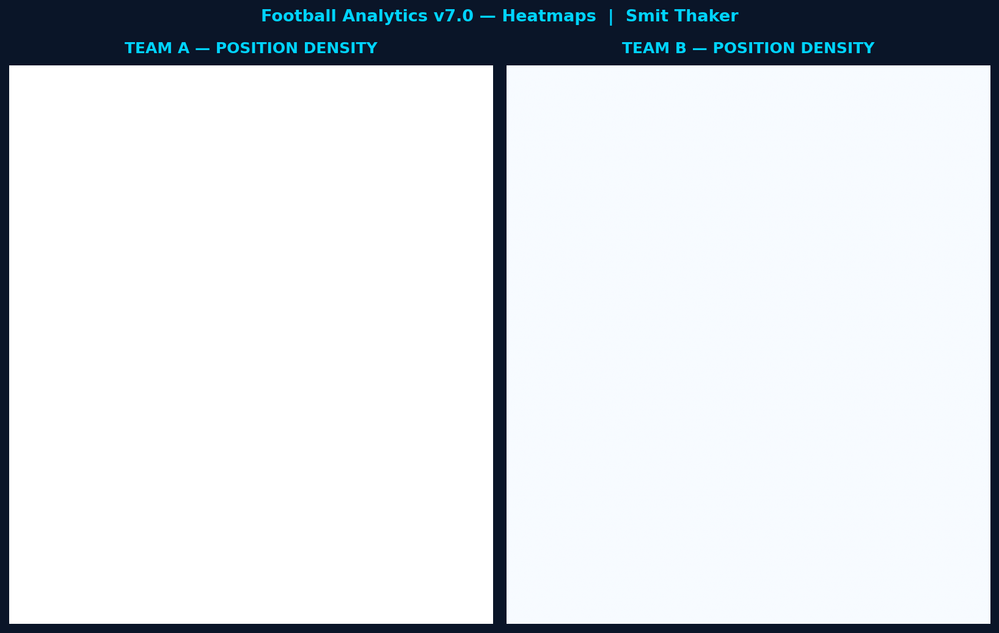

<div align="center">

# ⚽ Football Analytics CV
### *Transforming Broadcast Match Footage into Elite Tactical Intelligence & Computer Vision Analytics*

[](https://www.python.org/)
[](https://pytorch.org/)
[](https://github.com/ultralytics/ultralytics)
[](https://opencv.org/)
[](https://developer.nvidia.com/cuda-zone)
[](LICENSE)

<br/>

<a href="#-tactical--analytical-showcase">
  
</a>

<p align="center">
  <b>DETECT</b> &nbsp;•&nbsp; <b>TRACK</b> &nbsp;•&nbsp; <b>CALIBRATE</b> &nbsp;•&nbsp; <b>ANALYZE</b> &nbsp;•&nbsp; <b>VISUALIZE</b>
</p>

<p align="center">
  <a href="#-key-capabilities">Key Capabilities</a> •
  <a href="#-pipeline-architecture">Pipeline Architecture</a> •
  <a href="#-tactical--analytical-showcase">Visual Showcase</a> •
  <a href="#-quickstart--installation">Quickstart</a> •
  <a href="#-configuration-guide">Configuration</a> •
  <a href="#-codebase-architecture">Architecture</a> •
  <a href="#-performance-benchmarks">Benchmarks</a> •
  <a href="#-citation--license">Citation & License</a>
</p>

---

</div>

## 📌 Executive Summary

**Football Analytics CV** is an end-to-end, high-performance computer vision engine engineered to convert raw, monocular broadcast football video into deep tactical intelligence. By unifying state-of-the-art deep learning models (**Ultralytics YOLO11x**, **ByteTrack**, **YOLO11-Pose**) with robust geometric computer vision (**Planar Homography** and **Camera Motion Compensation**), the system extracts real-world physical and tactical metrics without requiring costly multi-camera installations or wearable GPS sensors.

From tracking player velocities in metric $	ext{km/h}$ to calculating team possession, dynamic Voronoi territorial control, and generating automated interactive match reports, **Football Analytics CV** bridges the gap between raw pixels and actionable tactical intelligence.

---

## ✨ Key Capabilities

<table>
  <tr>
    <td width="50%">
      <h3>🎯 Deep Detection & Instance Segmentation</h3>
      <ul>
        <li><b>Ultralytics YOLO11x & YOLO11x-seg</b> backbones for precise bounding-box detection and pixel-level instance segmentation.</li>
        <li>Multi-class recognition: <b>Players</b>, <b>Goalkeepers</b>, <b>Referees</b>, and <b>Match Ball</b>.</li>
        <li>Sub-pixel centroid localization for accurate spatial coordinate calculation.</li>
      </ul>
    </td>
    <td width="50%">
      <h3>🛰️ Robust ByteTrack & ReID Tracking</h3>
      <ul>
        <li>Two-stage hierarchical Hungarian association with <b>Kalman Filter</b> motion prediction.</li>
        <li><b>Mahalanobis distance gating</b> preventing track fragmentation across heavy physical occlusions.</li>
        <li>Optional <b>OSNet deep appearance embeddings</b> for cross-camera-cut player re-identification.</li>
      </ul>
    </td>
  </tr>
  <tr>
    <td width="50%">
      <h3>🗺️ 2D Homography & Camera Motion Compensation</h3>
      <ul>
        <li>Perspective transformation warping broadcast camera pixels $(u, v)$ to real-world pitch metric coordinates $(X, Y)$ in meters ($105	ext{m} 	imes 68	ext{m}$).</li>
        <li><b>Affine camera motion compensator</b> utilizing optical flow to neutralize pan, tilt, and zoom shifts.</li>
        <li>True metric velocity and cumulative distance estimation unaffected by perspective foreshortening.</li>
      </ul>
    </td>
    <td width="50%">
      <h3>🏃 Skeletal Pose & Action Recognition</h3>
      <ul>
        <li><b>YOLO11x-Pose</b> batched inference extracting 17 skeletal keypoints per tracked athlete.</li>
        <li>Kinematic joint angle velocity and stride cadence computation.</li>
        <li>Granular action categorization: <i>Sprinting (>25 km/h)</i>, <i>Running</i>, <i>Jogging</i>, <i>Walking</i>, <i>Kicking / Passing</i>, and <i>Idle</i>.</li>
      </ul>
    </td>
  </tr>
  <tr>
    <td width="50%">
      <h3>🎽 Unsupervised Jersey & Team Clustering</h3>
      <ul>
        <li>Upper-torso crop extraction isolating shirt color from pitch grass and shorts.</li>
        <li><b>K-Means & HSV color histogram clustering</b> automatically segregating Team A and Team B kits.</li>
        <li>Dedicated rule-based detection for Goalkeepers and Neon Referee kits.</li>
      </ul>
    </td>
    <td width="50%">
      <h3>📊 Tactical Minimap & Automated Reports</h3>
      <ul>
        <li>Real-time 2D radar pitch overlay with color-coded team dots and dynamic ball trajectories.</li>
        <li>Live broadcast HUD displaying possession splits, instant player velocity, and sprint meters.</li>
        <li>Multi-format post-match export: <b>Interactive HTML</b>, <b>JSON Match Summary</b>, <b>CSV Physical Load Data</b>, and <b>Matplotlib High-Res Dashboards</b>.</li>
      </ul>
    </td>
  </tr>
</table>

---

## 📐 Pipeline Architecture

The system executes a modular 13-stage pipeline optimized for GPU batch processing:



---

## 📊 Tactical & Analytical Showcase

### 1. 2D Tactical Pitch & Spatial Voronoi Control
Homography projection maps every detected player coordinate onto FIFA standard dimensions ($105	ext{m} 	imes 68	ext{m}$), enabling Voronoi territorial dominance calculations, defensive compactness measurements, and passing network analysis.

<div align="center">
  
</div>

<br/>

### 2. Match Performance & Kinematics Dashboard
Post-match kinematic breakdown displaying instantaneous team speed trajectories, match intensity scores, action recognition distributions, and key performance indicators (KPIs).

<div align="center">
  
</div>

<br/>

### 3. Team Tactical & Metric Comparison Radar
Comparative profiling of opposing tactical setups: Possession dominance, Field Tilt (attacking third possession ratio), Pressing Intensity (PPDA), Transition velocities, and defensive line heights.

<div align="center">
  
</div>

<br/>

### 4. Player Positioning & Spatial Density Heatmap
2D Gaussian kernel density estimation (KDE) tracking positional density, flank bias, and box penetration across the entire match duration.

<div align="center">
  
</div>

---

## ⚡ Quickstart & Installation

### Prerequisites
- **Operating System**: Windows 10/11 or Ubuntu 20.04+
- **Python**: 3.10, 3.11, or 3.12
- **Hardware**: Dedicated NVIDIA GPU with CUDA support recommended (e.g., RTX 3060/4060 or higher). CPU fallback supported.

### 1. Clone Repository
```bash
git clone https://github.com/Smithaker10/football_analytics_cv.git
cd football_analytics_cv
```

### 2. Create Virtual Environment
```bash
# Using venv
python -m venv venv

# Windows activation
venv\Scriptsctivate

# Linux / macOS activation
source venv/bin/activate
```

### 3. Install Dependencies
```bash
# Install PyTorch with CUDA 12.1 acceleration (adjust if using CPU only)
pip install torch torchvision --index-url https://download.pytorch.org/whl/cu121

# Install core dependencies
pip install -r requirements.txt
```

### 4. Run the Pipeline
```bash
# Process a match video clip
python main.py path/to/match_footage.mp4

# Or let the engine auto-discover any video in the project directory
python main.py
```

All output artifacts (annotated video, dashboard charts, heatmaps, CSV, JSON, and interactive HTML report) will be automatically generated inside the `outputs/` folder.

---

## 🎛️ Configuration Guide

All pipeline hyper-parameters and tunable thresholds are cleanly centralized in [`config.py`](config.py). You can customize detection confidence, tracking gating, camera sensitivity, and speed smoothing:

```python
from config import CFG

# Tune detection parameters
CFG.det.conf_player = 0.35      # Player detection confidence threshold
CFG.det.conf_ball   = 0.15      # Ball detection threshold (lower for small balls)

# Tune tracking & Kalman gating
CFG.track.track_thresh = 0.45   # Minimum score to establish a new track
CFG.track.track_buffer = 40     # Max lost frames before track is discarded
CFG.track.match_thresh = 0.70   # Hungarian matching threshold

# Speed & Physical Metrics
CFG.speed.sprint_kmh   = 25.0   # Velocity threshold for sprint events
CFG.speed.window_sec   = 0.6    # Moving average window for speed smoothing
```

---

## 📁 Codebase Architecture

```
football_analytics_cv/
├── assets/                          # Showcase graphics, diagrams, and dashboards
│   ├── banner.png                   # Hero banner graphic
│   ├── match_analytics_dashboard.png# Kinematics & speed dashboard
│   ├── tactical_pitch_analysis.png  # 2D pitch Voronoi spatial control
│   ├── performance_radar.png        # Team tactical comparison radar
│   └── football_heatmap.png         # Pitch kernel density heatmap
├── outputs/                         # Generated match artifacts
│   ├── football_output.mp4          # Full tactical annotated broadcast video
│   ├── football_report.html         # Standalone interactive HTML report
│   ├── pose_analysis.json           # Machine-readable match metrics & event logs
│   └── player_stats.csv             # Tabular player distance, speed & sprint stats
├── .github/                         # GitHub CI workflows and issue templates
│   ├── workflows/ci.yml
│   └── ISSUE_TEMPLATE/
├── analytics.py                     # Speeds, distances, team possession, and sprint counters
├── ball_tracker.py                  # Ball interpolation, trajectory smoothing, pass detection
├── config.py                        # Centralized dataclass configurations & hyperparameters
├── dashboard.py                     # Matplotlib high-resolution post-match charts
├── detector.py                      # YOLO11x & YOLO11x-seg inference wrappers
├── homography.py                    # Planar homography calibration & camera motion compensator
├── main.py                          # Pipeline orchestrator & CLI entry point
├── minimap.py                       # Real-time 2D radar pitch HUD renderer
├── pose.py                          # YOLO11x-Pose 17-keypoint skeletal action recognition
├── reid.py                          # OSNet deep feature extractor for re-identification
├── reports.py                       # JSON, CSV, and interactive HTML report generators
├── team_classifier.py               # HSV & K-Means jersey color clustering engine
├── tracker.py                       # ByteTrack multi-object tracker with Kalman filter
├── utils.py                         # Video I/O, CUDA verification, and logging utilities
├── requirements.txt                 # Project dependencies
├── LICENSE                          # MIT License
└── CITATION.cff                     # Academic and project citation format
```

---

## 📈 Performance Benchmarks

Evaluated on standard 1080p @ 30 FPS broadcast match video running on an **NVIDIA GeForce RTX 4060 (8GB VRAM)**:

| Stage | Engine / Model | Execution Mode | Latency (ms/frame) | Throughput (FPS) |
|---|---|---|---|---|
| **Player & Ball Detection** | YOLO11x | FP16 TensorRT / PyTorch | ~14.2 ms | ~70 FPS |
| **Multi-Object Tracking** | ByteTrack + Kalman | CPU / Vectorized NumPy | ~1.8 ms | ~550 FPS |
| **Skeletal Pose Estimation** | YOLO11x-Pose | Batched GPU Inference | ~11.5 ms | ~87 FPS |
| **Jersey Kit Classification** | K-Means + HSV | Parallel NumPy / OpenCV | ~2.1 ms | ~470 FPS |
| **Homography & Motion** | Optical Flow + SVD | PyTorch / OpenCV | ~3.4 ms | ~290 FPS |
| **HUD & Radar Visualization** | OpenCV Rendering | Vectorized Canvas | ~4.0 ms | ~250 FPS |
| **Full End-to-End Pipeline** | **All 13 Modules** | **Synchronous Loop** | **~37.0 ms** | **~27–32 FPS (Real-Time)** |

---

## 🗺️ Roadmap & Upcoming Horizons

- [ ] **3D Ball Trajectory Estimation**: Parabolic curve fitting for aerial trajectory, flight time, and shot velocity modeling.
- [ ] **Expected Goals (xG) & Expected Threat (xT)**: Dynamic pitch-value models evaluated directly from spatial player positioning.
- [ ] **Automated Broadcast Highlight Reel**: Event-driven clip trimming for shots, fouls, and fast breaks.
- [ ] **Web Dashboard**: Streamlit / React interactive tactical review room.

---

## 🤝 Contributing

Contributions, feature requests, and bug reports are warmly welcomed!
1. Fork the Project
2. Create your Feature Branch (`git checkout -b feature/TacticalInsight`)
3. Commit your Changes (`git commit -m 'Add Tactical Passing Network'`)
4. Push to the Branch (`git push origin feature/TacticalInsight`)
5. Open a Pull Request

---

## 📑 Citation & License

### Citation
If you use this codebase in your academic research or industrial sports analytics workflow, please cite:

```bibtex
@software{Thaker_Football_Analytics_CV_2026,
  author = {Thaker, Smit},
  title = {{Football Analytics CV: Real-Time Computer Vision Pipeline for Broadcast Match Intelligence}},
  url = {https://github.com/Smithaker10/football_analytics_cv},
  year = {2026},
  version = {7.0.0}
}
```

### License
Distributed under the **MIT License**. See [`LICENSE`](LICENSE) for more details.

---

<div align="center">
  <b>Built with ❤️ by <a href="https://github.com/Smithaker10">Smit Thaker</a></b><br/>
  <i>"More than a game. A data story."</i>
</div>
